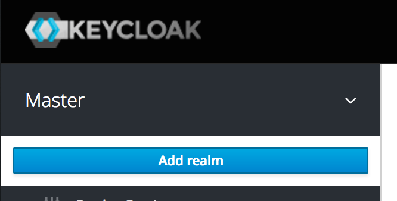
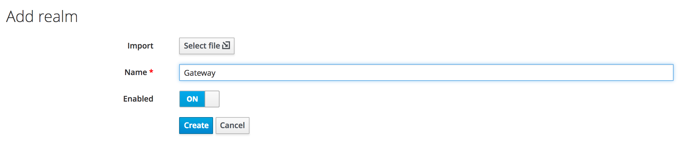
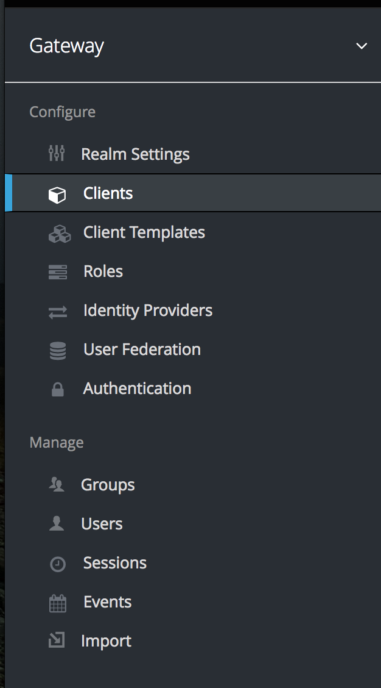

#### Background
Using a federated authentication mechanism with an API gateway

#### Prerequisites
Clone the **Tyk Quickstart** repository from [https://github.com/nextmetaphor/tyk_quickstart](https://github.com/nextmetaphor/tyk_quickstart). This repository is a fork of the [https://github.com/TykTechnologies/tyk_quickstart](https://github.com/TykTechnologies/tyk_quickstart) repository, additionally adding a [Keycloak](https://hub.docker.com/r/jboss/keycloak/) container to the environment that we will integrate with our API gateway.

#### Setup
From within the root of the cloned repository, execute the following command...

```aidl
cp tyk_analytics.conf.dist tyk_analytics.conf
```

...then install as detailed in the `README.md` file. 

#### Configuring Keycloak
Once the environment has been started, log into the Keycloak admin console at [http://localhost:38080/auth/admin](http://localhost:38080/auth/admin). The username is `admin`; the password is `admin123`. 

##### Create Realm
The first thing we'll do is to set up a new *Realm*. This is just a way of logically grouping our security elements together. In the top left-hand side of the screen, click on the dropdown next to *Master*



Click on the *Add realm* button, and fill in the details as follows:



Check that once the realm has been created, we are by default placed into the new realm.

##### Create Client
We now need to create an OAuth 2.0 client. This will be used to generate the token that we'll pass to the API gateway. Select the *Clients* menu option as shown below.



From the panel on the right-hand side, click on the *Create* button, then fill in the details as shown below.

#### Generate `password` Grant Type 
The following commands need to be run on the Tyk gateway node - this is to ensure that the DNS we use to refer to the Keycloak server is correct within the scope of the environment.
```bash
docker exec -it tykquickstart_tyk_gateway_1 bash
```


```bash
export CLIENT_ID="gateway-client"
export USERNAME="user1"
export PASSWORD="password12"

curl --silent -X POST http://tykquickstart_keycloak_1:8080/auth/realms/Gateway/protocol/openid-connect/token  -H "Content-Type: application/x-www-form-urlencoded" -d "username=$USERNAME" -d "password=$PASSWORD" -d "grant_type=password" -d "client_id=$CLIENT_ID" | json_pp
```


grant_type=